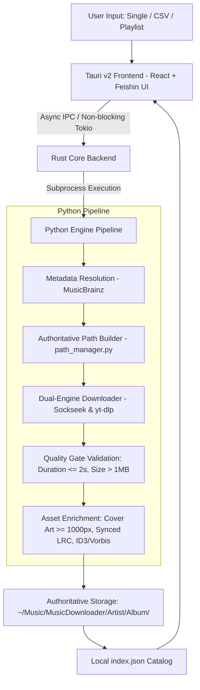

# SheroFetch

[](https://www.gnu.org/licenses/agpl-3.0)
[-orange.svg)](https://github.com/meet-the-1337/SheroFetch/releases)
[](https://tauri.app)

> Resolve messy song/artist input into clean metadata and fetch high-quality audio for your personal library — single search, bulk lists, playlist links, or CSV import, all with a preview-before-download workflow.

---

## ⚖️ Legal & Scope Disclaimer

**SheroFetch is a media organization and metadata resolution utility created exclusively for personal library management.** This project does not host, mirror, cache, or distribute any copyrighted media files. It is intended solely for archiving content that users have the explicit legal right to download (e.g., Creative Commons, public domain works, artist-authorized content, or personal archival backups where permissible by law). Users bear full responsibility for ensuring their usage complies with all applicable local copyright laws and the Terms of Service of any external network services accessed.

---

## 💡 Why This Exists

Downloading music traditionally results in cluttered folders: ambiguous file names, missing album tags, blurry or missing cover artwork, out-of-sync lyrics, and inconsistent directory layouts.

**SheroFetch solves the "messy input → structured library" pipeline:**
1. You provide imperfect input: a track query, a pasted CSV list, or a public playlist URL.
2. The engine resolves canonical metadata via **MusicBrainz** and verifies duration and releases before touching disk.
3. Audio is acquired in bit-perfect **FLAC Lossless** (or 320kbps MP3) through dual-engine fallback with strict quality validation gates ($\le 2.0$s tolerance, $> 1$MB).
4. Files are deterministically organized into an authoritative hierarchy: `~/Music/MusicDownloader/{Artist}/{Album}/`, fully enriched with embedded tags, $\ge 1000$px cover art, and synchronized `.lrc` lyrics.

---

## ✨ Features

- 🔍 **Fuzzy Input Resolution**: Automatic normalization, artist alias resolution, and confidence scoring via MusicBrainz before any download begins.
- 📋 **Multi-Source Acquisition**:
  - **Single Song & Artist Search**: Search canonical recordings with duration and file size estimates.
  - **CSV File Batch Import**: Upload `.csv` or paste raw text rows (`Artist, Title`), preview tracks via checklist, and batch install.
  - **Playlist Link Extraction**: Instant tracklist extraction from public playlists.
- 🎛️ **Audio Quality & Formats**:
  - **FLAC Lossless**: P2P queries prioritized via Sockseek with bit-perfect Vorbis comments and embedded picture blocks.
  - **MP3 (320kbps)**: Compact high-bitrate encoding.
- 👁️ **Preview-Before-Download**: Every download prompts with target directory confirmation and metadata fallback simulation.
- 🎨 **Feishin-Inspired Visuals**:
  - Atmospheric ambient background that dynamically tints to match the active album artwork colors.
  - **Synchronized Lyrics Showcase**: Fullscreen lyrics reader powered by locally acquired `.lrc` files with bright active line highlighting.
  - **Album & Artist Showcase**: High-density table, album cards, and artist discography views.
  - Zero playback bloat: One-click launching into your native system player (VLC, MPV, Amberol) for bit-perfect audio reproduction.
- 🛡️ **Authoritative Hierarchy**: Enforces `~/Music/MusicDownloader/{Artist}/{Album}/` with input sanitization and verification leakage guards.

---

## 🏛️ Architecture



---

## 🚀 Quick Start

### 1. Download Pre-Built Releases
Grab the latest release package from the [Releases Page](https://github.com/meet-the-1337/SheroFetch/releases):

#### 🪟 Windows (Primary Release)
- **[SheroFetch-Windows-x64.exe](https://github.com/meet-the-1337/SheroFetch/releases/download/v1.0.0/SheroFetch-Windows-x64.exe)** — Standalone portable 64-bit Windows executable. Simply download and double-click to run!

#### 🐧 Linux
- **Debian / Ubuntu / Linux Mint**:
  ```bash
  sudo dpkg -i sherofetch_1.0.0_amd64.deb
  ```
- **Arch Linux / Manjaro**:
  ```bash
  sudo pacman -U sherofetch-bin-1.0.0-1-x86_64.pkg.tar.zst
  ```
- **Portable Linux Executable**:
  ```bash
  chmod +x sherofetch-linux-x86_64
  ./sherofetch-linux-x86_64
  ```

### 2. Run from Source
```bash
# Clone the repository
git clone https://github.com/meet-the-1337/SheroFetch.git
cd SheroFetch

# Install Python requirements
pip install -r requirements.txt

# Run the standalone launcher
./launch_music_downloader.sh
```

---

## 🗺️ Roadmap

- [x] High-performance native Windows executable (`SheroFetch-Windows-x64.exe`)
- [x] High-performance Tauri v2 + React desktop client for Linux (Arch & Debian)
- [x] Multi-source acquisition: Single song, CSV batch import, and playlist links
- [x] Lossless FLAC format selection with Soulseek P2P prioritization
- [x] Synchronized `.lrc` lyrics showcase with atmospheric dynamic background
- [ ] **Remote API Mode**: Headless daemon mode with REST / WebSocket API for local network control
- [ ] **Mobile Companion App**: Android APK interface connecting to the desktop remote API
- [ ] **macOS DMG**: Signed native `.dmg` bundle for macOS

---

## 🤝 Contributing

Contributions are welcome! Please read [CONTRIBUTING.md](CONTRIBUTING.md) for code style guidelines and compliance requirements.

---

## 📄 License

This project is licensed under the **GNU Affero General Public License v3.0 (AGPL-3.0)** — see the [LICENSE](LICENSE) file for details.
