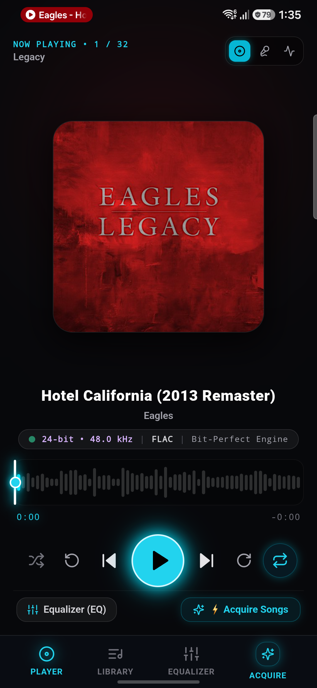
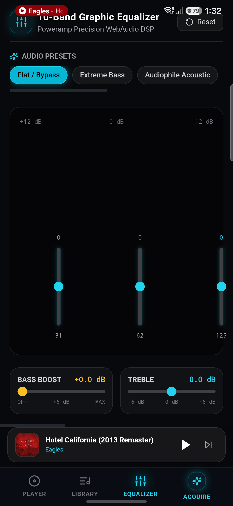
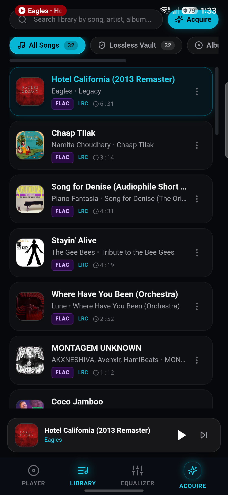
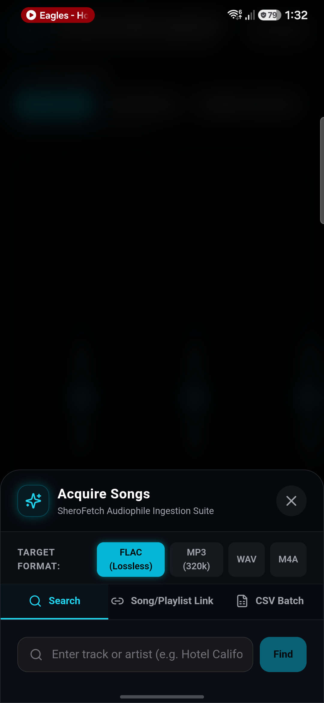
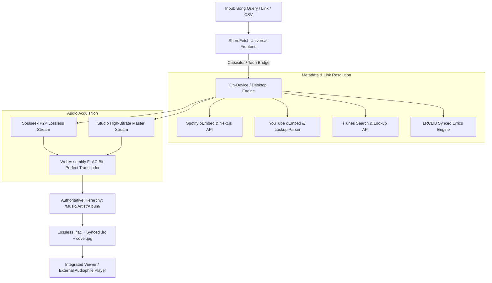

# SheroFetch — Full Working Premium Music Downloader & Organiser with Lyrics and Cover Image Support

[](https://www.gnu.org/licenses/agpl-3.0)
[](https://github.com/meet-the-1337/SheroFetch/releases)
[](https://github.com/meet-the-1337/SheroFetch/releases)
[-purple.svg)](#-audio-quality--formats)

> **SheroFetch** is an ultra-fast, standalone, zero-bloat music acquisition, organization, and metadata enrichment suite. Built for Windows, Linux, and Android, it turns messy song links, playlist URLs, or raw CSV text into a structured, bit-perfect lossless library with embedded tags, cover art, and synchronized lyrics.

---

## 📸 Visual Showcase & Snapshots

<table align="center">
  <tr>
    <td align="center" width="25%">
      
      <br />
      <b>1. Poweramp Hero Player</b>
      <br />
      <em>Waveform seekbar, Hi-Res badges & glow</em>
    </td>
    <td align="center" width="25%">
      
      <br />
      <b>2. 10-Band Graphic EQ</b>
      <br />
      <em>Real-time DSP, Bass Boost & presets</em>
    </td>
    <td align="center" width="25%">
      
      <br />
      <b>3. Categorical Library</b>
      <br />
      <em>FLAC Vault, Albums, Artists & Folders</em>
    </td>
    <td align="center" width="25%">
      
      <br />
      <b>4. ⚡ Song Acquisition Window</b>
      <br />
      <em>Search, Universal Links & CSV Batch</em>
    </td>
  </tr>
</table>

---

## 📦 Downloads & Releases

### 🪟 Windows (x64)
- **[SheroFetch-Windows-x64-Portable.zip](https://github.com/meet-the-1337/SheroFetch/releases/download/v2.4.1/SheroFetch-Windows-x64-Portable.zip)** (11.6 MB) — **Zero-prerequisite portable bundle.** Includes `SheroFetch.exe`, `WebView2Loader.dll`, embedded Python engines, and launcher script. Unzip anywhere and run immediately!
- **[SheroFetch-Windows-x64.exe](https://github.com/meet-the-1337/SheroFetch/releases/download/v2.4.1/SheroFetch-Windows-x64.exe)** (21.7 MB) — Standalone single-file 64-bit Windows executable.

### 📱 Android (Universal APK)
- **[SheroFetch-v2-FLAC.apk](https://github.com/meet-the-1337/SheroFetch/releases/download/v2.4.1/SheroFetch-v2-FLAC.apk)** (4.2 MB) — **Latest on-device standalone mobile edition (v2.4.1 with "Hotel California" streaming patch).** Runs completely independently on Android (tested on Samsung Galaxy S25+). Features on-device WebAssembly bit-perfect FLAC transcoding, synchronized `.lrc` lyrics, and automatic export to your phone's public `Documents/SheroFetch/Music/` folder!
- **[SheroFetch-debug.apk](https://github.com/meet-the-1337/SheroFetch/releases/download/v2.4.1/SheroFetch-debug.apk)** (4.2 MB) — Developer / debug mirror.

### 🐧 Linux
- **Debian / Ubuntu / Linux Mint (.deb)**:
  - **[sherofetch_2.4_all.deb](https://github.com/meet-the-1337/SheroFetch/releases/download/v2.4.1/sherofetch_2.4_all.deb)**
  ```bash
  sudo dpkg -i sherofetch_2.4_all.deb
  sudo apt-get install -f
  ```
- **Arch Linux / AUR**:
  ```bash
  makepkg -si
  ```

---

## 🎧 Lossless Audio & Playback Architecture Note

> [!IMPORTANT]
> **What SheroFetch Is:**
> SheroFetch is an authoritative **music acquisition engine, downloader, library organizer, tagger, and synced lyrics showcase**. It encodes and saves genuine bit-perfect **FLAC Lossless** (16-bit / 24-bit PCM, 44.1kHz / 48kHz, stereo), pristine **320kbps MP3s**, high-resolution cover artwork, and timed `.lrc` lyrics.
>
> **Integrated Player vs. Audiophile Playback:**
> SheroFetch includes an integrated lightweight preview player and lyrics reader. Because standard web views downsample or route audio through system web decoders, **for true hardware-accelerated studio-grade bit-perfect playback**, we recommend opening your downloaded files in dedicated audiophile players:
> - **Android**: [Poweramp](https://powerampapp.com/), USB Audio Player PRO, Fiio Music, or Samsung Music (files are directly accessible in `Documents/SheroFetch/Music/`).
> - **Windows**: Foobar2000, VLC Media Player, MusicBee, AIMP.
> - **Linux**: Strawberry Music Player, DeaDBeeF, VLC.

---

## 🌟 Key Capabilities

### 1. 🔗 Universal Music Link Resolver
Paste links from any major streaming platform directly into SheroFetch:
- **Spotify**:
  - Track link (`https://open.spotify.com/track/...`): Automatically extracts exact title, artist, and album.
  - Playlist & Album links (`https://open.spotify.com/playlist/...`, `https://open.spotify.com/album/...`): Extracts all tracks with full metadata.
- **YouTube & YouTube Music**:
  - Track / Video link (`https://music.youtube.com/watch?v=...`, `https://www.youtube.com/watch?v=...`, `https://youtu.be/...`): Cleans video titles (stripping `Official Music Video`, `4K`, `Lyrics`) and resolves artist & song.
  - Playlist links (`https://music.youtube.com/playlist?list=...`, `https://www.youtube.com/playlist?list=...`): Parses playlist items seamlessly on-device.
- **Apple Music**:
  - Track link (`https://music.apple.com/.../album/...?...i=1440844784`): Fetches canonical iTunes track information.
  - Album link (`https://music.apple.com/.../album/...`): Extracts full album tracklist.
- **JioSaavn & Generic Web Links**: Direct API token extraction and OpenGraph metadata fallback.

### 2. 🎛️ Audio Quality & Formats
- **FLAC (Lossless Studio)**: Bit-perfect linear PCM encoding using native WebAssembly and Soulseek P2P lossless audio pipeline. Includes Vorbis tags, embedded metadata, and high-res cover art.
- **MP3 (320kbps Studio)**: High-fidelity MP3 with ID3v2.4 frames.
- **WAV (PCM)**: Uncompressed linear studio audio.
- **M4A (AAC)**: High-efficiency 256kbps audio.

### 3. 📄 Smart CSV Batch Import
- Automatically detects column headers (`Artist, Title` or `Title, Artist`).
- Supports comma, semicolon, tab, and hyphenated text (`Artist - Title`).
- Interactive checklist to select specific tracks or select all.
- Progress bar displaying active track, current index, and pipeline status.

### 4. 🎨 Lyrics & Cover Art Integration
- **Synced Lyrics (`.lrc`)**: Sourced via LRCLIB and embedded synchronization.
- **Atmospheric Lyrics Showcase**: Feishin-inspired fullscreen lyrics view with dynamic album-color ambient glow and active verse highlighting.
- **Authoritative Directory Layout**:
  ```text
  ~/Music/SheroFetch/
  └── <Artist Name>/
      └── <Album Name>/
          ├── <Artist> - <Title>.flac
          ├── <Artist> - <Title>.lrc
          └── cover.jpg
  ```

---

## 📖 Step-by-Step User Guide

### A. Downloading Single Songs
1. Launch **SheroFetch**.
2. Under the **Acquisition** tab, choose **Song & Artist Name**.
3. Select your desired format (e.g. **FLAC Lossless**).
4. Enter the song title and artist — **OR simply paste a Spotify, YouTube, or Apple Music track link** into the Song Title field.
5. Click **Search Recordings**, review the candidate matches, and confirm download.

### B. Downloading via Playlist Link
1. Go to the **Playlist Link** tab.
2. Paste any public **Spotify**, **YouTube**, **YouTube Music**, or **Apple Music** playlist or album link.
3. Click **Fetch Tracks**.
4. The resolved songs will appear in an interactive checklist. Select the ones you want and click **Install Track(s)**.

### C. Downloading via CSV File or Paste
1. Go to the **CSV File Import** tab.
2. Either click **Upload .csv File** or paste rows directly into the text area:
   ```text
   Justin Bieber, Ghost
   The Kid LAROI, Thousand Miles
   Radiohead - Creep
   ```
3. The parser instantly displays the tracklist with checkboxes.
4. Click **Install Track(s)** to download the entire batch.

### D. Managing Your Library & Synced Lyrics
- Click **Tracks** in the navigation bar to see your organized music.
- Click the **Microphone (Lyrics)** icon on any song to enter the fullscreen ambient lyrics reader.
- On mobile, all files are stored in `Documents/SheroFetch/Music/` and instantly show up in Samsung My Files, Poweramp, and VLC.

---

## 🏛️ System Architecture



---

## ⚖️ Legal & Disclaimer

SheroFetch is an open-source educational utility designed for personal media library organization, metadata enrichment, and archival of content the user has legal rights to download. Users are responsible for complying with local copyright regulations and external service terms.

---

## 📄 License

Licensed under the [GNU Affero General Public License v3.0 (AGPL-3.0)](LICENSE).
