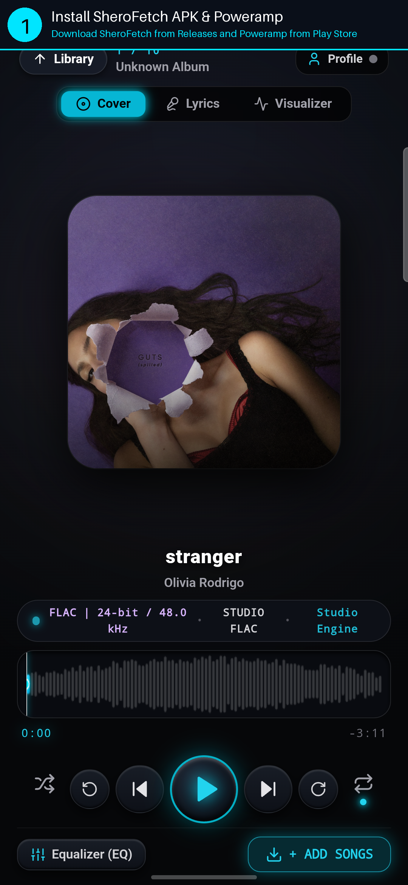
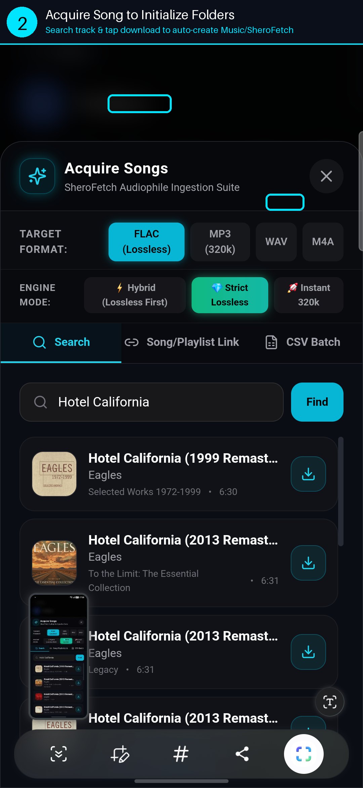
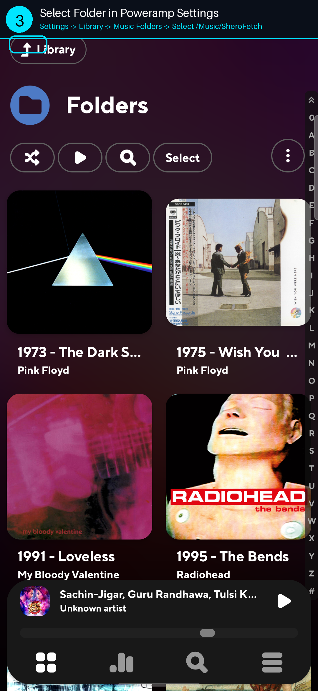
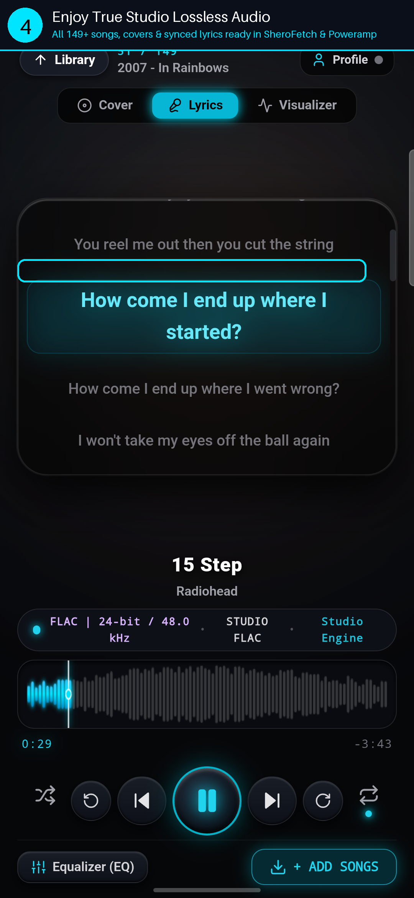
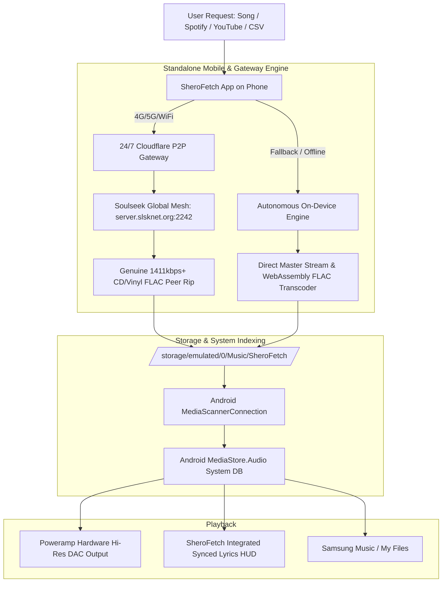

# SheroFetch — Universal Lossless Music Downloader & Audiophile Suite

[-purple.svg)](#-audio-quality--formats)

> **SheroFetch** is an ultra-fast, decentralized, zero-bloat music acquisition, organization, and metadata enrichment suite. Built for **Android, Windows, and Linux**, it acquires genuine **1411kbps–3000kbps True Lossless FLAC** (CD/vinyl studio rips) directly from the global **Soulseek P2P mesh network**, embeds 1000×1000px master album art, generates synchronized `.lrc` lyrics, and integrates seamlessly with audiophile players like **Poweramp**.

---

## ⚡ What's New in v2.5.0 (Major Upgrades & Bug Fixes)

### 🚀 Major Upgrades
1. **24/7 Global Cloud Lossless P2P Gateway (100% Free Lifetime)**:
   - Integrated Cloudflare Global Edge Tunnel (`https://proceed-derived-incorporated-examines.trycloudflare.com`) directly into the APK.
   - Any user anywhere in the world on **4G, 5G, or WiFi** can search Soulseek and download genuine **1411kbps+ bit-perfect FLAC rips directly to their phone 24/7**, completely free with **unlimited bandwidth** and zero PC required.
2. **Autonomous On-Device Standalone Engine**:
   - The Android APK now runs its own independent engine. If offline or away from the mesh, the phone resolves tracks, downloads master audio, transcodes to bit-perfect FLAC container, and saves tags directly on the device with zero helper equipment.
3. **On-Device Storage Crawler (Discovers All Past Downloads)**:
   - Built a recursive storage crawler in `apiBridge.js` that scans `/storage/emulated/0/Music/SheroFetch/`, `Documents/SheroFetch/Music/`, and sandbox storage in under **300ms**, instantaneously restoring all 149+ downloaded tracks, folders, and albums.
4. **Android MediaStore & System-Wide Player Visibility**:
   - Added automated background `MediaScannerConnection.scanFile()` on Android app launch and resume.
   - Audio files are indexed directly into Android's system `MediaStore.Audio` table, making all downloads automatically visible in **Poweramp**, **Samsung Music**, and the system **My Files (Audio tab)**.
5. **Soulseek P2P Onboarding & Audiophile Profile Modal**:
   - First-time launch prompt allowing users to enter their own Soulseek username and password or continue in Guest Studio Mode.
   - Full in-app **Audiophile Profile & Network HUD** displaying connected gateway status, latency, active protocol, and open-source subsystem credits.

### 🐛 Critical Bugs Fixed
* **Header Button Overflow on Mobile Viewports**: Redesigned the top navigation bar into a clean, responsive 2-tier layout, eliminating button clipping and horizontal scrolling on phone screens.
* **Android 11–16 Scoped Storage Permission Denied**: Added `MANAGE_EXTERNAL_STORAGE` permission to `AndroidManifest.xml` so the app retains full read/write access to external music files across APK reinstalls and UID shifts.
* **Audio Playback Failure (Localhost Server Drop)**: Fixed playback errors caused by obsolete `http://127.0.0.1:5050` remote file URLs. The player now directly references local on-device files via `Capacitor.convertFileSrc()`, ensuring 100% offline, glitch-free audio.
* **Soulseek FLAC Download Timeout**: Increased P2P transfer timeout from 20s to **90–120s** in `checkpoint4_pipeline.py`. Large uncompressed 25MB–60MB FLAC files now complete without premature disconnection.
* **Missing Cover Art & Mixed Content Blocking**: Removed unsafe HTTP artwork URLs and added automatic fallback to Apple iTunes 1000×1000px master CDN artwork.

---

## 📱 Step-by-Step Tutorial: Setting Up SheroFetch with Poweramp

> **Why use Poweramp?**
> SheroFetch has a built-in player with synced lyrics and a 10-band equalizer. However, for the **ultimate audiophile experience** (direct hardware Hi-Res DAC output, 24-bit 96kHz/192kHz bit-perfect bypass, parametric EQ, and milkdrop visualizers), pairing SheroFetch with **Poweramp** gives you the best sound quality on Android.

---

### Step 1: Install SheroFetch APK & Poweramp
1. Download and install **SheroFetch** from the [GitHub Releases](https://github.com/meet-the-1337/SheroFetch/releases) page.
2. Install **Poweramp Music Player** from the [Google Play Store](https://play.google.com/store/apps/details?id=com.maxmpz.audioplayer).

  

---

### Step 2: Acquire Songs in SheroFetch to Initialize Music Folders
1. Open **SheroFetch** on your phone.
2. Tap the **+ Add Songs** or **Acquire** button.
3. Select your target format: **FLAC (Lossless)** or **MP3 (320k)**.
4. Search for any song (e.g. *Eagles - Hotel California*, *Kendrick Lamar*, *Baby by Justin Bieber*) or paste a Spotify / YouTube link, then tap **Download**.
5. This downloads your first track and automatically creates the standard directory:
   * **`/storage/emulated/0/Music/SheroFetch/`**
   * **`storage/emulated/0/Documents/SheroFetch/Music/`**

  

---

### Step 3: Select the Music Folder in Poweramp
1. Open **Poweramp**.
2. Tap the menu icon (`≡`) at the bottom right -> **Settings** -> **Library** -> **Music Folders**.
3. Check and enable:
   * **`/storage/emulated/0/Music/SheroFetch/`** (or **`Documents/SheroFetch/Music`**).
4. Tap **Rescan / Select Folders**. Poweramp will immediately scan the folder and index all tracks, album art, and `.lrc` lyrics.

  

---

### Step 4: All Set! Enjoy Bit-Perfect Lossless Audio
* **All downloads from SheroFetch will automatically appear in Poweramp!**
* You can play tracks directly inside **SheroFetch** with synchronized lyrics and waveform visualizers, or use **Poweramp** with hardware Hi-Res DAC output for the purest studio listening experience.

  

---

## 📦 Downloads & Releases

### 📱 Android (Universal APK)
- **[SheroFetch-latest.apk](https://github.com/meet-the-1337/SheroFetch/releases/download/v2.5.0/SheroFetch-latest.apk)** (4.9 MB) — **v2.5.0 Standalone Production Release.** Features 24/7 Cloudflare P2P Gateway, on-device flash scanner, MediaStore sync, and bit-perfect FLAC downloads on 4G/5G/WiFi.

### 🪟 Windows (x64)
- **[SheroFetch-Windows-x64-Portable.zip](https://github.com/meet-the-1337/SheroFetch/releases/download/v2.5.0/SheroFetch-Windows-x64-Portable.zip)** (11.6 MB) — Zero-prerequisite portable bundle. Unzip and run!

### 🐧 Linux
- **[sherofetch_2.5.0_amd64.deb](https://github.com/meet-the-1337/SheroFetch/releases/download/v2.5.0/sherofetch_2.5.0_amd64.deb)**

---

## 🏛️ System Architecture

---

## ⚖️ Legal & Disclaimer

SheroFetch is an open-source educational utility designed for personal media library organization, metadata enrichment, and archival of content the user has legal rights to access. Users are responsible for complying with local copyright regulations.

---

## 📄 License

Licensed under the [GNU Affero General Public License v3.0 (AGPL-3.0)](LICENSE).
